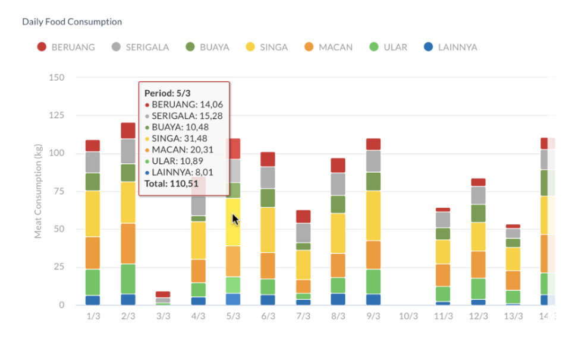

# Zoo Monitoring Dashboard

You have **2 (two) full days to complete and send your solution**. Please create a solution with your version of best practices and good code principles in mind. You may add your own assumption if there is no boundary defined.

You will be given a base project with some pre-installed packages to start with, and **you must use React, Highcharts, and Material UI in your code**. 
However, if you need to add another package, you may do so.

To submit, please send us the **.zip file of your source code that includes the Git metadata (.git folder)**, thus we could look at your commit logs and understand the process.

## Problem Statement

I own a small not-for-profit zoo that is privately managed and supported by society.

Currently, I have problem on managing the zoo, as the data is in a mess and all over the place.

To resolve the problem as well as provide transparency among the volunteers, I plan to create a simple monitoring dashboard for the zoo. The dashboard includes report for data such as animals’ health, food procurement, food consumption, and ticket selling. 

Below is the mock-up of the report:

I have several meat-eater animals. They consume meat as their main diet. However, due to current condition, they consume meat in an irregular basis, as the meat stock is not always full. 

Currently, I store the raw data of the meat consumption in json format. 
- You will need to **fetch the data** from url `/api/food-consumption.json` and display them into a chart using `Highcharts` in the `/food-consumption` page.
- The chart must be **readable and interactive**, so that I could make necessary actions on their diet schedule. 
- It also needs to be **horizontally scrollable**, as this is only one part of the food consumption report in one page.